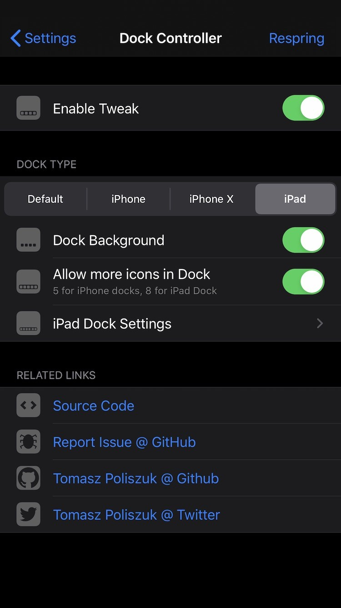
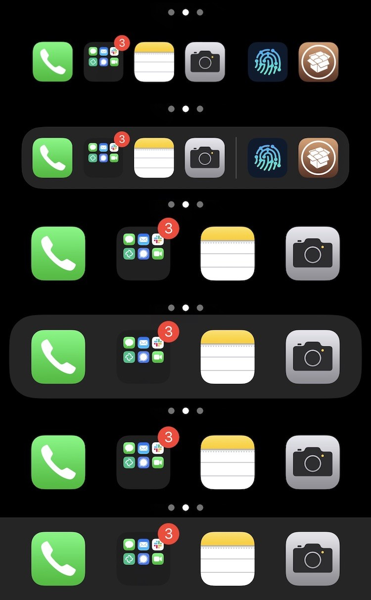
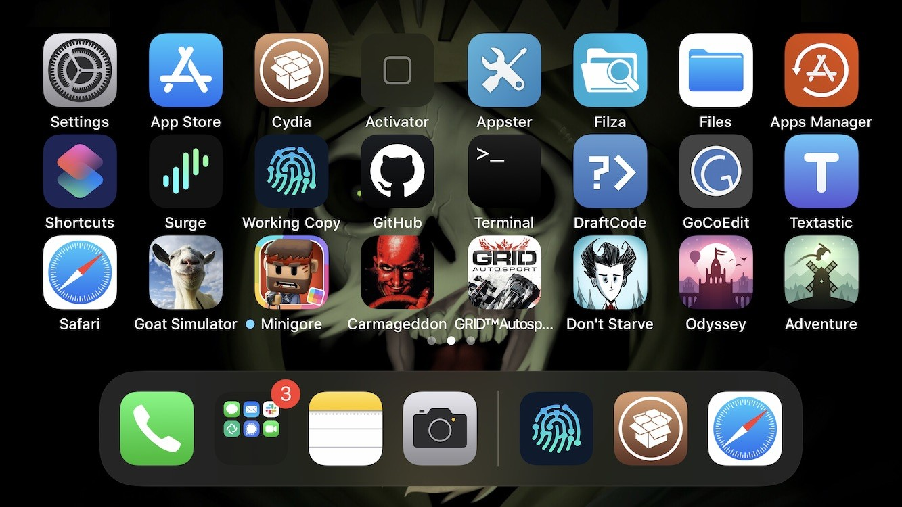

*Dock Controller - Control Your Dock*

**Requires iOS greater or equal to 13 and iPhone or iPod Touch device**

**Possibilities:**
- Choose Dock Type (Default, Disabled, iPhone, iPhone X, iPad)
- Dock Background (enabled, disabled)
- Allow more icons in Dock (5 for iPhone docks, 8 for iPad Dock)
- iPad Dock Type options:
- - Dock Divider (enabled, disabled)
- - Maximum number of Recent applications (0 - 3)
- - Fix icons layout on Springboard (enabled, smaller dock, disabled)

**works also in landscape orientation**

Configure options from Settings.

**Screenshots:**

