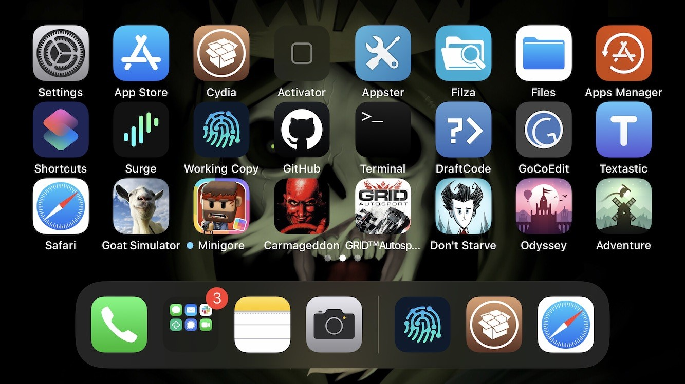

# Dock Controller
Control Your Dock

## Compatibility
* iOS 13 and above

## Features:
* Choose Dock Type (Default, Disabled, Square, Rounded, iPad)
* Dock Background (enabled, disabled)
* Allow more icons in Dock (8 for iPad Dock 5 for rest of them) - currently disabled on iOS 14
* iPad Dock Type options:
    * Maximum number of Recent applications (0 - 3)
    * Dock Divider (enabled, disabled)
    * Show in App Switcher (enabled, disabled)
    * Gesture to show Dock in apps
    * Fix icons layout on Springboard for Portrait orientation (enabled, disabled)
    * Fix icons layout on Springboard for Landscape orientation (enabled, disabled)

**Configure options from Settings.**

## Screenshots:

