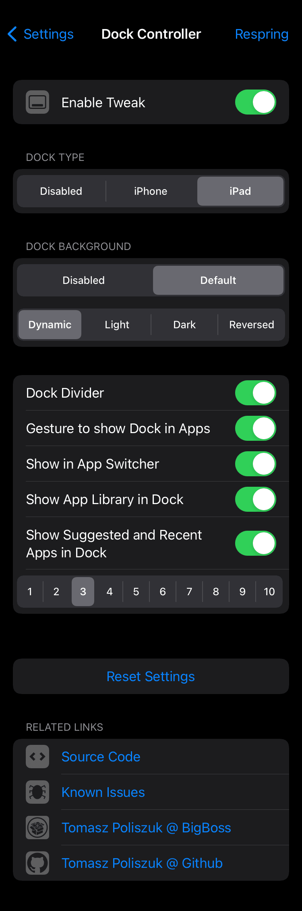
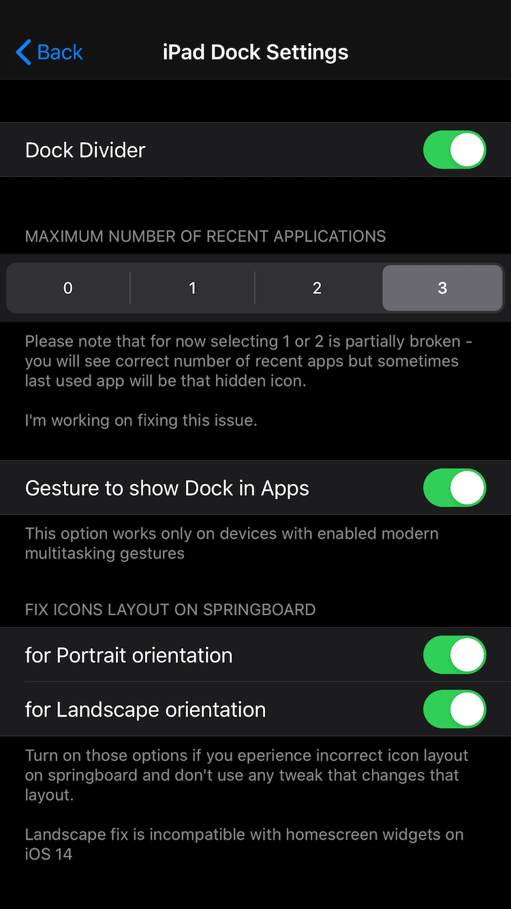
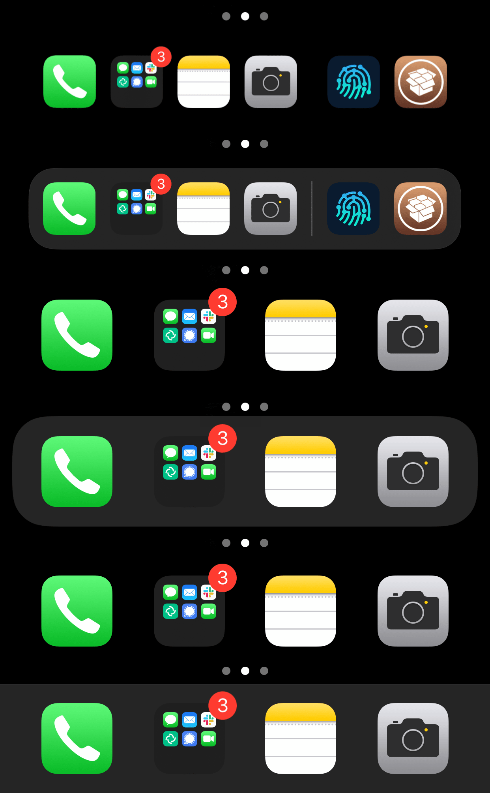
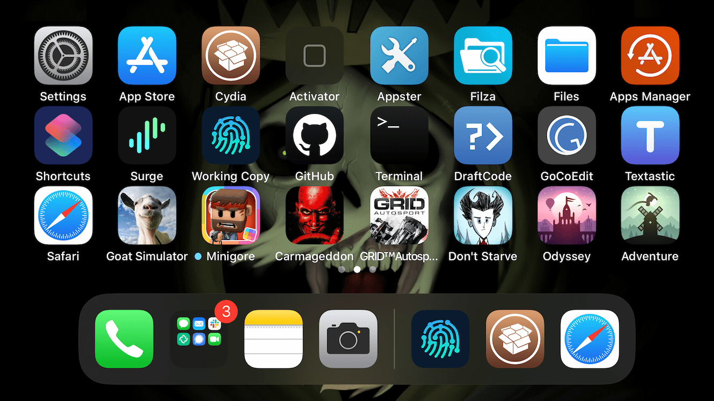

# Dock Controller
Control Your Dock

## Compatibility
* iOS 12 and above

## Features:
* Choose Dock Type (Default, Disabled, Square, Rounded, iPad)
* Dock Background (enabled, disabled)
* Allow more icons in Dock (8 for iPad Dock 5 for rest of them)
* iPad Dock Type options:
	* Maximum number of Recent applications (0 - 3)
	* Dock Divider (enabled, disabled)
	* Show in App Switcher (enabled, disabled)
	* Gesture to show Dock in apps
	* Springboard icons layout helpers (disabled, static, dynamic) for Portrait and Landscape orientations

**Configure options from Settings.**

## Credits:
* [Brian](https://github.com/brian9206/) for [HomeDockX recents](https://github.com/brian9206/HomeDockX/blob/a22752377e18586941be57dbbb496a9d2d9fac07/src/Dock.xm#L66-L69)
* [Kritanta](https://github.com/KritantaDev) for [macros from stratosphere pull request](https://github.com/Samgisaninja/stratosphere/pull/1#pullrequestreview-542780232) - it's better to DRY

## Screenshots:

