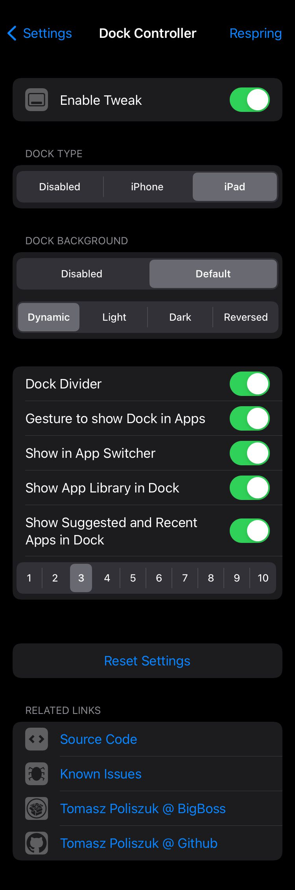

# Dock Controller
Control Your Dock

## Compatibility
Requires iPhone or iPod Touch device running iOS 13.0+

## Possibilities:
- Choose Dock Type (Default, Disabled, iPhone, iPhone X, iPad)
- Dock Background (enabled, disabled)
- Allow more icons in Dock (5 for iPhone docks, 8 for iPad Dock)
- iPad Dock Type options:
- - Dock Divider (enabled, disabled)
- - Maximum number of Recent applications (0 - 3)
- - Option to disable dock inside apps for devices witch modern multitasking gestures enabled
- - Fix icons layout on Springboard (enabled, smaller dock, disabled)
- Works in landscape orientation

Configure options from Settings.

## Screenshots:

